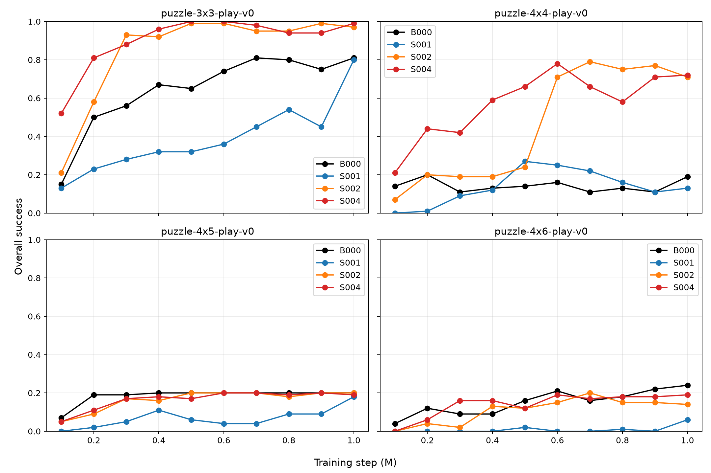
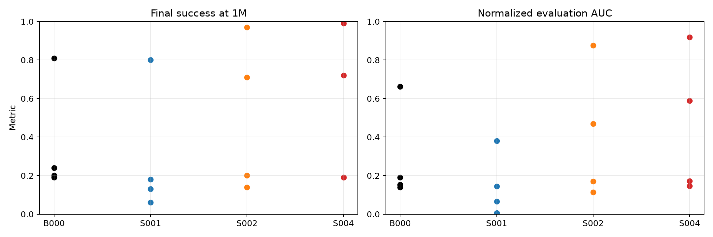

# M16A 实验结果报告：Puzzle 复杂度 × Structured MLP-Mixer 深度

**报告日期：2026-08-28**  
**状态：16/16 个正式单元完成；本报告是 seed 0 的完整描述性分析，不是跨 seed 的确认性统计结论。**

## 1. 执行摘要

M16A 的核心结果不是“MLP-Mixer 总是更好”，而是一个清晰的、随环境复杂度变化的非单调图景：

- 在 `puzzle-3x3-play-v0`，足够深的结构化 Mixer 明显优于 Flat：S002/L2 与 S004/L4 的 final success 分别为 `0.97/0.99`，相对 B000/Flat 的 `0.81` 提升 `+0.16/+0.18`。
- 在 `puzzle-4x4-play-v0`，L2/L4 的提升更大：`0.71/0.72` 对 `0.19`，提升 `+0.52/+0.53`；task-level success 显示提升覆盖多个 task，并非仅 task1 的偶然波动。
- 在 `puzzle-4x5-play-v0`，所有条件最终均在 `0.18–0.20`，且只解决 task1；增加 Mixer 深度没有打破该难度屏障。
- 在 `puzzle-4x6-play-v0`，Flat 的 final success 为 `0.24`，结构化 L1/L2/L4 为 `0.06/0.14/0.19`，均未超过 Flat。L4 恢复了 task1，但失去了 Flat 在 task2 上的成功率。

因此，seed 0 的证据支持：**全 actor/value/critic 的 Puzzle-token MLP-Mixer 配置在 3x3 与 4x4 上有效，且需要至少 L2；它在 4x5 上没有收益，在 4x6 上未超过 Flat。** 这支持“存在任务依赖的有效区间”，不支持“结构化 MLP-Mixer 对所有 Puzzle 复杂度普遍更优”。

下一步不宜立刻盲目加深 Mixer。优先顺序应是：

1. 对现有 last@1M checkpoint 做 task-wise、共同随机种子、每 task 100 episodes 的无训练复评，先降低当前 20 episodes/task 的评估噪声。
2. 对完整 16-cell 矩阵补 seed 1–4（总共 n=5），确认正效应、零效应和 4x6 的负效应是否可复现。
3. 仅在效应复现后做 placement/机制拆分；M16A 同时改变 actor、value、critic，不能把收益唯一归因给 policy-side Mixer、critic-side Mixer 或 tokenization 中的某一个因素。

## 2. 设计、数据完整性与可复现性

### 2.1 设计

| 因素 | 固定设置 |
|---|---|
| 算法 | canonical GCIQL，`actor_loss=ddpgbc`，`alpha=0.3`，`expectile=0.9`，`tau=0.005`，`lr=3e-4` |
| 训练 | seed 0；1,000,000 steps；batch 1024 |
| 评估 | 每 100k steps；5 tasks；每 task 20 episodes；temperature 0；Gaussian noise `null` |
| 条件 | B000 Flat；S001 Structured Mixer L1；S002 L2；S004 L4 |
| 结构化 placement | actor、value、critic 同时启用 Puzzle-token MLP-Mixer |
| 结构化固定项 | `token_dim=128`、robot hidden 128、token MLP 64、channel MLP 256、index embedding、mean readout、`tm_mode=none` |
| 环境 | Puzzle 3x3/4x4/4x5/4x6，按钮数分别为 9/16/20/24 |

所有条件在相同训练 seed 下运行；同一 checkpoint step 的评估 seed 由 `(training seed=0, step, task id)` 派生，因此**同环境、同 checkpoint step 的条件比较共享评估随机性协议**。这改善了条件间的可比性，但不替代独立训练 seed 的重复。

### 2.2 完整性与 provenance

- 16 个 run 的 `runtime_metadata.json` 均为 `status=completed`；每个 `eval.csv` 都有从 100k 到 1M 的 10 个完整评估点。
- 16 个 run 的 runtime metadata 记录同一代码提交：`635e5518b8dcd04176f081f5237b1e114ef6e878`。
- 正式运行时使用的 Study/config 路径位于冻结快照 `/home/eai/Research/RLC-m16a-exp/`；结果写入 `/data/qijunrong/06-RL/offline-rl/exp/RLC/runs/M16A/`。本报告没有改动任何 run artifact。
- 原始结果的统一导出在 [raw_eval_long.csv](M16A_results/raw_eval_long.csv)：共 160 行，每一行保留 config、环境、condition、step、task1–task5 success、overall success 与原始 run path。
- 处理后的 endpoint 表在 [results_long.csv](M16A_results/results_long.csv)，机器可读汇总在 [results_summary.json](M16A_results/results_summary.json)。

### 2.3 指标解释

`final` 为 last@1M 的 `evaluation/overall_success`；`best` 是十个训练期评估点中的最大值；`last-3` 为 800k/900k/1M 的均值；AUC 是 100k–1M 十个评估点的梯形积分除以 900k。

每个 task 在 20 个 episode 上评估，因此单 task success 的最小变化单位为 `0.05`；overall 是五个 task 的平均，最小变化单位为 `0.01`。例如 `0.72` 对 `0.71` 仅相差两个总评估 episode，不能在没有更多 episode 和更多训练 seed 的情况下解读为可靠的模型差异。

## 3. 主要 endpoint 与架构成本

下表是 16 个单元的完整 endpoint。`Δfinal` 始终指同环境相对 B000；参数量和 Dense MAC 是整个 GCIQL agent 合计，critic ensemble 已计入。

| 环境 | 条件 | final@1M | Δfinal | best@step | last-3 | norm AUC | 参数量(M) | Dense MAC(M) | 深度 A/V/C |
|---|---|---:|---:|---:|---:|---:|---:|---:|---:|
| 3x3 | B000 | 0.81 | — | 0.81@700k | 0.787 | 0.662 | 2.347 | 2.332 | 4/4/4 |
| 3x3 | S001 | 0.80 | -0.01 | 0.80@1M | 0.597 | 0.379 | 0.833 | 3.535 | 7/7/7 |
| 3x3 | S002 | 0.97 | +0.16 | 0.99@500k | 0.970 | 0.877 | 1.102 | 6.484 | 11/11/11 |
| 3x3 | S004 | 0.99 | +0.18 | 1.00@500k | 0.957 | 0.918 | 1.639 | 12.382 | 19/19/19 |
| 4x4 | B000 | 0.19 | — | 0.20@200k | 0.143 | 0.139 | 2.462 | 2.446 | 4/4/4 |
| 4x4 | S001 | 0.13 | -0.06 | 0.27@500k | 0.133 | 0.144 | 0.841 | 5.858 | 7/7/7 |
| 4x4 | S002 | 0.71 | +0.52 | 0.79@700k | 0.743 | 0.470 | 1.113 | 11.100 | 11/11/11 |
| 4x4 | S004 | 0.72 | +0.53 | 0.78@600k | 0.670 | 0.589 | 1.657 | 21.586 | 19/19/19 |
| 4x5 | B000 | 0.20 | — | 0.20@400k | 0.200 | 0.191 | 2.527 | 2.512 | 4/4/4 |
| 4x5 | S001 | 0.18 | -0.02 | 0.18@1M | 0.120 | 0.066 | 0.845 | 7.185 | 7/7/7 |
| 4x5 | S002 | 0.20 | +0.00 | 0.20@500k | 0.193 | 0.169 | 1.119 | 13.738 | 11/11/11 |
| 4x5 | S004 | 0.19 | -0.01 | 0.20@600k | 0.193 | 0.171 | 1.667 | 26.845 | 19/19/19 |
| 4x6 | B000 | 0.24 | — | 0.24@1M | 0.213 | 0.152 | 2.593 | 2.577 | 4/4/4 |
| 4x6 | S001 | 0.06 | -0.18 | 0.06@1M | 0.023 | 0.007 | 0.849 | 8.512 | 7/7/7 |
| 4x6 | S002 | 0.14 | -0.10 | 0.20@700k | 0.147 | 0.114 | 1.125 | 16.376 | 11/11/11 |
| 4x6 | S004 | 0.19 | -0.05 | 0.19@600k | 0.183 | 0.146 | 1.678 | 32.105 | 19/19/19 |

成本解释需要特别谨慎：结构化 L1/L2/L4 的参数量低于 Flat，但 Dense MAC 随 token 数和深度快速增加。因此 M16A 不是参数或 MAC 匹配实验；“更好/更差”不能被归结为单纯的模型大小或单纯的计算量。

## 4. 原始 overall-success 学习曲线

以下为 `evaluation/overall_success` 的全部 100k 间隔原始序列，顺序均为 `100k, 200k, …, 1M`。逐 task 的全部 160 条原始记录见 [raw_eval_long.csv](M16A_results/raw_eval_long.csv)。

| 环境 | B000 | S001 / L1 | S002 / L2 | S004 / L4 |
|---|---|---|---|---|
| 3x3 | .15, .50, .56, .67, .65, .74, .81, .80, .75, .81 | .13, .23, .28, .32, .32, .36, .45, .54, .45, .80 | .21, .58, .93, .92, .99, .99, .95, .95, .99, .97 | .52, .81, .88, .96, 1.00, 1.00, .98, .94, .94, .99 |
| 4x4 | .14, .20, .11, .13, .14, .16, .11, .13, .11, .19 | .00, .01, .09, .12, .27, .25, .22, .16, .11, .13 | .07, .20, .19, .19, .24, .71, .79, .75, .77, .71 | .21, .44, .42, .59, .66, .78, .66, .58, .71, .72 |
| 4x5 | .07, .19, .19, .20, .20, .20, .20, .20, .20, .20 | .00, .02, .05, .11, .06, .04, .04, .09, .09, .18 | .05, .09, .17, .16, .20, .20, .20, .18, .20, .20 | .05, .11, .17, .18, .17, .20, .20, .19, .20, .19 |
| 4x6 | .04, .12, .09, .09, .16, .21, .16, .18, .22, .24 | .00, .00, .00, .00, .02, .00, .00, .01, .00, .06 | .00, .04, .02, .13, .12, .15, .20, .15, .15, .14 | .00, .06, .16, .16, .12, .19, .17, .18, .18, .19 |

可视化版本：

## 5. 原始 task-level 终点数据

下表直接列出 1M 时五个 task 的 success。当前日志仅把任务标识保存为 `task1`–`task5`，因此本报告不对其赋予未记录的语义名称。

| 环境 | 条件 | task1 | task2 | task3 | task4 | task5 | overall |
|---|---|---:|---:|---:|---:|---:|---:|
| 3x3 | B000 | 1.00 | .80 | .70 | .70 | .85 | .81 |
| 3x3 | S001 | .95 | .95 | .75 | .65 | .70 | .80 |
| 3x3 | S002 | 1.00 | 1.00 | .95 | .90 | 1.00 | .97 |
| 3x3 | S004 | 1.00 | 1.00 | 1.00 | 1.00 | .95 | .99 |
| 4x4 | B000 | .20 | .00 | .55 | .20 | .00 | .19 |
| 4x4 | S001 | .55 | .00 | .10 | .00 | .00 | .13 |
| 4x4 | S002 | .95 | .10 | .80 | .80 | .90 | .71 |
| 4x4 | S004 | .90 | .35 | .70 | .80 | .85 | .72 |
| 4x5 | B000 | 1.00 | .00 | .00 | .00 | .00 | .20 |
| 4x5 | S001 | .90 | .00 | .00 | .00 | .00 | .18 |
| 4x5 | S002 | 1.00 | .00 | .00 | .00 | .00 | .20 |
| 4x5 | S004 | .95 | .00 | .00 | .00 | .00 | .19 |
| 4x6 | B000 | .95 | .25 | .00 | .00 | .00 | .24 |
| 4x6 | S001 | .30 | .00 | .00 | .00 | .00 | .06 |
| 4x6 | S002 | .70 | .00 | .00 | .00 | .00 | .14 |
| 4x6 | S004 | .95 | .00 | .00 | .00 | .00 | .19 |

这张表提供了两个重要约束：

1. 4x4 的 L2/L4 收益是广泛的。以 L2 为例，相对 Flat 的 task-level 差值是 `(+.75, +.10, +.25, +.60, +.90)`；L4 是 `(+.70, +.35, +.15, +.60, +.85)`。
2. 4x5/4x6 并非“overall 低但所有 task 都略有进展”。4x5 的所有条件在 task2–task5 都是 0；4x6 的 L4 保留 task1 `.95`，但 task2 从 Flat 的 `.25` 降到 0，task3–task5 仍全部为 0。这提示后续问题首先是 task coverage / hard-task barrier，而不是简单的总体 success 均值。

## 6. 分环境分析

### 6.1 Puzzle-3x3：存在清晰的深度阈值，L2 已足够有效

L1 的 final `.80` 与 Flat `.81` 几乎相同，但其 AUC `.379` 明显低于 Flat `.662`，last-3 也只有 `.597`。其在 1M 的突然上升不应被误读为稳定的学习优势。

L2 从 300k 即达到 `.93`，500k 达到 `.99`，final `.97`；L4 在 100k 已有 `.52`，500k 达到 `1.00`，final `.99`。相对 Flat，L2/L4 的 task2–task5 均有显著提高。这里的证据支持“L1 不足、L2/L4 有效”的阈值图景。

然而 L4 相比 L2 的 final 差距仅 `.02`、AUC 差距 `.042`，而 MAC 约为 L2 的 1.91 倍。因此若只看本环境的成本—效益，L2 是更保守的候选；L4 的小优势须经多 seed 和更多评估 episode 验证。

### 6.2 Puzzle-4x4：最强的结构化正效应，但 L2/L4 的取舍取决于指标

Flat 长期停留在 `.11–.20`，L1 同样未解决问题。L2 在 600k 由 `.24` 跳到 `.71`，L4 在 200k 已有 `.44`、400k `.59`，随后达到 `.78` best。两者 final 几乎相同（`.71/.72`），但 L4 的 AUC 更高（`.589/.470`），说明其早期学习更快；L2 的 last-3 更高（`.743/.670`），说明 L2 的末期曲线在 seed 0 下更稳定。

因此，4x4 并不能支持“更深必然更好”：L4 的 early/AUC 优势与 L2 的 late-window 优势需要在多 seed 下分别验证。可以确定的是，L2/L4 都远优于 Flat 和 L1，且收益覆盖多个 task。

### 6.3 Puzzle-4x5：所有方法卡在同一 task barrier

B000 和 L2 final 都为 `.20`，L4 `.19`，L1 `.18`；所有条件只完成 task1，task2–task5 全部为 0。L2/L4 的 AUC 还略低于 Flat，说明它们并未更快越过障碍，只是最终回到 task1 的相同水平。

这里最合理的当前结论是“该 structured configuration 未解决 4x5 的困难任务”，而不是“Mixer 被证明无效”。因为所有条件都失败在相同的 task2–task5，下一步应先区分数据/任务覆盖限制与表示/优化限制。

### 6.4 Puzzle-4x6：深度可部分恢复 task1，但未恢复 Flat 的 task2

L1 的失败最明显（final `.06`）；L2 `.14`；L4 `.19`，显示在结构化家族内部深度仍有正向趋势。但 Flat 为 `.24`，所以深度增加尚不足以达到基线。

task-level 结果更有信息量：L4 的 task1 为 `.95`，与 Flat 相同；但 Flat 的 task2 是 `.25`，L4/L2/L1 都为 0。这说明 4x6 的总体落后并非只因“整个 policy 无法行动”，而是没有获得第二个任务的能力。针对 task2 的数据支持、goal 条件和 rollout 失败模式应该成为下一轮诊断重点。

## 7. 可以与不可以作出的科学结论

### 当前证据支持

- 对 3x3 和 4x4 的 seed 0 run，**joint actor+value+critic 的 structured Puzzle-token MLP-Mixer** 在 L2/L4 时显著优于 canonical Flat GCIQL。
- L1 在四个环境中都没有形成稳定优势，说明“使用 Mixer”本身不是充分条件；深度/容量阈值重要。
- Mixer 深度收益不是随着按钮数单调增大：从 3x3 到 4x4 仍有强正效应，但在 4x5 消失、在 4x6 转为不如 Flat。
- 4x5/4x6 的失败高度 task-specific，不能只用 overall 平均值解释。

### 当前证据不支持

- 不能声称 MLP-Mixer 在所有 Puzzle 环境中都优于 Flat。
- 不能声称 L4 普遍优于 L2；3x3 的 L4–L2 final 差 `.02`，4x4 为 `.01`，均接近当前评估的细粒度。
- 不能把收益唯一归因给 MLP-Mixer：M16A 同时改变了 tokenization、结构化 body、计算深度、参数量/MAC，以及 actor/value/critic 三个 placement。
- 不能把 seed 0 的差值当作训练随机性的显著性结论；每 task 20 episodes 的评估噪声和单训练 seed 都尚未量化。

## 8. 推荐的下一步实验方向

### P0：先做低成本的 checkpoint 复评（不训练）

对 16 个 `last@1M` checkpoint，以统一 task/episode seed 对每个 task 评估 100 episodes（建议同时保留现有 20-episode 结果）。输出 task-wise mean、binomial confidence interval 和相对 B000 的 paired difference。目标是判断：

- 3x3 L4 相对 L2 的 `.02` final 差异是否只是评估抽样；
- 4x4 L4 的 early/AUC 优势和 L2 的 late-window 优势是否仍存在；
- 4x6 Flat 的 task2 `.25` 是否稳定存在，以及 L4 是否确实为 0。

这是最先应做的动作，因为它不改变训练、直接提高现有 checkpoint 的测量精度。

### P1：确认性多 seed 复制

若目标是对“复杂度依赖的深度效应”作总体陈述，推荐不按 seed 0 的结果筛选：对**完整 16-cell 矩阵补 seed 1–4**，与现有 seed 0 合并为 n=5。这样能够同时验证 L1 的负结果、4x5 的零效应和 4x6 的负效应，避免只复制成功条件导致选择性证据。

如果算力不足，可将一个较小的、明确标注为 data-conditioned 的确认子集预注册为：

| 环境 | 条件 | 新增 run（seed 1–4） | 目的 |
|---|---|---:|---|
| 3x3 | B000/S001/S002/S004 | 16 | 验证深度阈值与 L2–L4 饱和 |
| 4x4 | B000/S001/S002/S004 | 16 | 验证 strongest positive regime |
| 4x6 | B000/S004 | 8 | 验证 deep structured 是否仍落后 Flat |

该精简方案共 40 个新 run；它不能替代完整矩阵对 4x5 或 L1 泛化性的结论。

### P2：在确认正效应后做 placement/机制拆分

M16A 的强正效应来自 actor、value、critic 同时结构化，下一轮应避免再混合多个因素。建议以 3x3 和 4x4 的 L2 为最先的机制锚点，固定同一 structured body，只比较：

1. Flat B000；
2. actor-only structured；
3. value+critic-only structured；
4. actor+value+critic structured（M16A S002 的复现锚点）。

该设计能回答收益主要来自 policy realization、value/critic estimation，还是二者协同。只有在这一步后，才适合把结论具体称为“actor-side MLP-Mixer 效应”或“critic-side MLP-Mixer 效应”。

### P3：4x5/4x6 先做 task-support 诊断，再设计新架构

在投入新的结构变体前，应针对 task2–task5 做数据和 rollout 审计：

- 每个 task 的离线数据覆盖、成功轨迹数量、目标状态分布与状态—目标距离；
- Flat 与 L2/L4 last checkpoint 在每 task 的成功/失败 episode；
- 4x6 task2 上 Flat 成功而 structured 失败的轨迹对照；
- 学习曲线中 task-wise success 是否从未起步，还是中期出现后退化。

若诊断显示数据支持不足，继续加深 Mixer 的预期收益很低；若 Flat 有足够支持而 structured 特别失败，才有理由继续研究 token/goal 融合、token communication 或优化稳定性，而不是直接扩大深度。

## 9. 建议的决策门槛

在复评和多 seed 之前，最稳妥的项目决策是：

- 将 L2 作为 3x3/4x4 的主要结构化候选，将 L4 作为“可能具有更快早期学习、但成本更高”的比较条件；
- 不将 L1 用作后续主力候选；
- 不把 4x5/4x6 纳入“已被 Mixer 改善”的结论；
- 不启动更深 L8 或更大 hidden width 的大规模 sweep，直到 task-support 诊断与多 seed 复制完成。

这样下一轮实验将回答尚未解决的因果问题，而不是在 seed 0 曲线的局部峰值上继续扩展。
